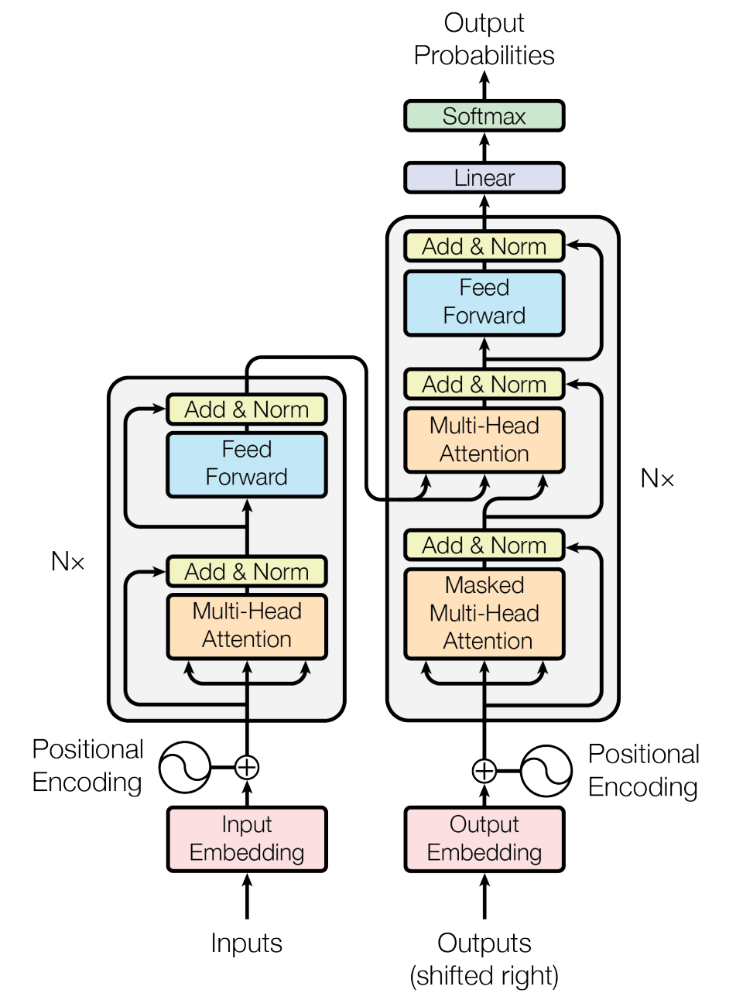
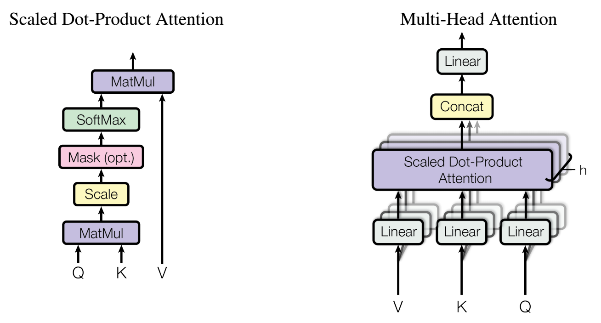

[TOC]

## Transformer

> **Attention is All You Need** (NIPS 2017)
>
> Ashish Vaswani, Noam Shazeer, Niki Parmar, Jakob Uszkoreit, Llion Jones, Aidan N. Gomez, Łukasz Kaiser, Illia Polosukhin

> **BERT: Pre-training of Deep Bidirectional Transformers for Language Understanding**
> Jacob Devlin Ming-Wei Chang Kenton Lee Kristina Toutanova

### Intuition

- Sequential models (like RNNs) precludes parallelzation because output of position *t* in conditioned on the output of position *t - 1*. For bi-directional RNNs the problem is even more severe, since every position cannot resolve its output before at least half of the layer has finished computation.

- Distant dependencies are hard to grasp.

  > The number of operations required to relate signals from two arbitrary input or output positions grows linearly for ConvS2S and logarithmically for ByteNet.

  Using self-attention, the number of operations needed is constant, at the cost of reduced effective resolution, which is counteracted with Multi-Head Attention.

### Model Architecture


#### Embedding

- WordPiece Tokenization / Standard Tokenization (for Chinese texts)

  > Given a training corpus and a number of desired tokens *D*, the optimization problem is to select *D* wordpieces such that the resulting corpus is minimal in the number of wordpieces when segmented according to the chosen wordpiece model.
  >
  > **Google’s Neural Machine Translation System: Bridging the Gap between Human and Machine Translation**, Yonghui Wu, Mike Schuster, Zhifeng Chen, Quoc V. Le, Mohammad Norouzi et al.

  Initial vocabulary size: 0.5k~20k (number of basic characters)

  Final vocabulary size: 8k~32k (number of desired token)

  > Generate a new word unit by combining two units out of the current word inventory to increment the word unit inventory by one. Choice is made to maximize the increase to the likelihood of the language model on the training data.
  >
  > **Japanese and Korean Voice Search** (ICASSP 2012), Mike Schuster and Kaisuke Nakajima

- Embedding lookup

- Positional embeddings

  A signature indicating the position of the current token (word piece). The learned / fixed embedding matrix is of shape [max_position_embeddings, emb_dim], where max_position_embeddings ≥ max_seq_len. The emb_dim is aligned to the word embedding dimension so that they can add up directly.

  The Transformer used the following functions for positional embeddings: the value of the $i$^th^ demention of the embedding of the $pos$^th^ word in a sequence is

  $$PE[pos]_i = \sin \dfrac{pos}{10000^{i/emb\_dim}}$$ for even $i$s and $$PE[pos]_i = \cos \dfrac{pos}{10000^{(i-1)/emb\_dim}}$$ for odd $i$s.

  so that different positions will have different oscillation frequencies in their embeddings.

  BERT uses trained positional embeddings.

- Token type embeddings (Segment embeddings)

  Id of the current sentence in a paragraph sample, or id of the speaker of the current sentence. The learned embedding matrix is of shape [token_type_vocab_size, emb_dim], where token_type_vocab_size is usually max sentence length / the number of speakers. The emb_dim is aligned to the word embedding dimension so that they can add up directly.

*The initializer of above two additional embeddings is tf.truncated_normal_initializer with stddev=0.02.*

- Layer norm

  ```python
  def layer_norm(input_tensor, name=None):
    """Run layer normalization on the last dimension of the tensor."""
    return tf.contrib.layers.layer_norm(
        inputs=input_tensor, begin_norm_axis=-1, begin_params_axis=-1, scope=name)
  ```

  Layer norm is done only for the last axis of the final word embeddings matrix. Doing so **may** preserve the expressiveness of the model.

- Dropout



<p align="center">
An overview of the Transformer model
</p>
#### Encoder-Decoder Overview

The equation for a single-layer encoder / decoder is (see above figure for visualization)

$$\mathrm{Encoder\_layer}(x) = \mathrm{Layer}_\mathrm{FF}(\mathrm{Layer}_\mathrm{MHA}(x))$$

$$\mathrm{Decoder\_layer}(x) = \mathrm{Layer}_\mathrm{FF}(\mathrm{Layer}_\mathrm{EDA}(\mathrm{Layer}_\mathrm{MMHA}(x)))$$

where $$\mathrm{Layer}_\mathrm{SubLayer}(x) = \mathrm{LayerNorm}(x + \mathrm{SubLayer}(x))$$. $ \mathrm{Layer}_\mathrm{FF}$,  $\mathrm{Layer}_\mathrm{MHA}$, $\mathrm{Layer}_\mathrm{MMHA}$ and $\mathrm{Layer}_\mathrm{EDA}$ will be defined in the following sections. Layer input is a tensor of shape [batch_size, seq_len, hidden_size]. The layer norm operation, as aforementioned, is done only for the last axis.

The complete encoder contains N = 12 (base) / 24 (large) such layers.

#### Feed-Forward Intermediate Layers

The equation for one block of feed-forward intermediate "layer" (it is not a single layer) is:

$$\mathrm{Layer}_\mathrm{FF} (x) =\mathrm{GeLU}(x W_1 + b_1) W_2 + b_2 \quad where \quad \mathrm{GeLU}(x) = xP(X ≤ x) = xΦ(x)$$

Layer input is a tensor of shape [batch_size, seq_len, hidden_size]. $W_1$ is of shape [hidden_size, intermediate_size], while $W_2$ is of shape [intermediate_size, hidden_size].

> **Gaussian Error Linear Units (GeLUs)**
> Dan Hendrycks, Kevin Gimpel

#### Scaled Dot-Product Attention (self-att)

A scaled dot-product attention block performs the following operations:

$$\mathrm{Att} (Q, K, V) = \mathrm{softmax} (\mathrm{mask} \bigl( \dfrac{QK^T}{\sqrt{d_k}}) \bigr)V$$

What's intriguing is that $Q$, $K$, $V$ are all linear transformations of the embeded inputs (or previous outputs), thus the attention is essentially a self-attention. An attention mask is applied to both encoders and decoders to prevent the model from attending to padding tokens, and to decoders only to prevent the model from "peeking" the answer. In BERT, which lacks the decoder structure, the latter objective is achieved using a masked language model (MLM), where 15% of the tokens in training data are chosen, and replaced by: (1) a [MASK] token 80% of the time; (2) a random word 10% of the time; and (3) the word itself 10% of the time.

Below is a detailed explanation of the self-attention mechanism.

Consider a query vector $q_i \in \mathbb{R}^{d_q}$, which represents the current token, a key matrix $K \in \mathbb{R}^{L \times d_k}$ and a value matrix $V \in \mathbb{R}^{L \times d_v}$, which represents the whole context ($L$ is the maximum sequence length, $d_q$, $d_k$ and $d_v$ are embedding dimensions of corresponding vectors). We use $q_i$ and $k_j$ to compatibility of query $q_i$ with key $k_j$, or $e_{i,j}$.

Two types of attention mechanism could be used.

- Additive attention uses a feed-forward network with a single hidden layer to compute the compatibility.

  $$e_{i, j} = \omega^T \tanh (q_i + k_j + b)$$

  where $d_q=d_k$, $\omega$ is a vector with length $d_\mathrm{model}$.

- Dot-product attention calculates the dot product of the linearly transformed $q_i$ and $k_j$.

  $$e_{i,j} = q_i \cdot k_j$$

  where $d_q=d_k$.

The same query is issued for multiple keys, and the compatibility values are normalized using the softmax function.

$$\alpha_{i,j} = \dfrac{\exp(e_{i, j})}{\sum_k \exp (e_{i,k})}$$

With the attention weights at hand, the value vectors are transformed to attention outputs.

$$z_i = \sum_j \alpha_{i, j} v_j$$

> While the two are similar in theoretical complexity, dot-product attention is much faster and more space-efficient in practice, since it can be implemented using highly optimized matrix multiplication code.

In practice, additive attention outperforms dot product attention without scaling for larger values of $dk​$. This is attributed to the large magnitude of dot products, which pushes the softmax functions to extreme regions where it has small gradients. Assume that the components of $q_i​$ and $k_j​$ are independent random variables with mean 0 and variance 1. Then $e_{i,j}​$ would have mean 0 and variance $d_k​$. Thus, we scale the dot product with $\sqrt{d_k}​$ to counteract this effect.



#### Multi-Head Attention

A MHA layer performs the following computation:

$$\mathrm{Layer}_\mathrm{MHA}(x) = [\mathrm{Att}(xW_1^Q, xW_1^K, xW_1^V); \ \dots \ ; \mathrm{Att}(xW_h^Q, xW_h^K, xW_h^V) ]W^O$$

where $W^O$ is of shape [$h \times d_v$, $d_\mathrm{model}$]. $d_q$, $d_k$, $d_v$ are all set to $d_\mathrm{model} / h$ to reduce computational cost.

#### Final Layers (sequence output only)

The final linear layer is tied with the embedding layer following the following paper. In the embedding layers, weights are multiplied by $\sqrt{d_\mathrm{model}}$.

> **Using the Output Embedding to Improve Language Models**
> Ofir Press, Lior Wolf
